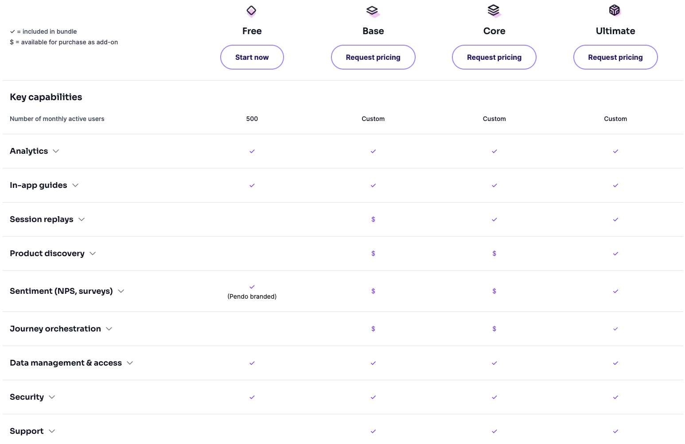
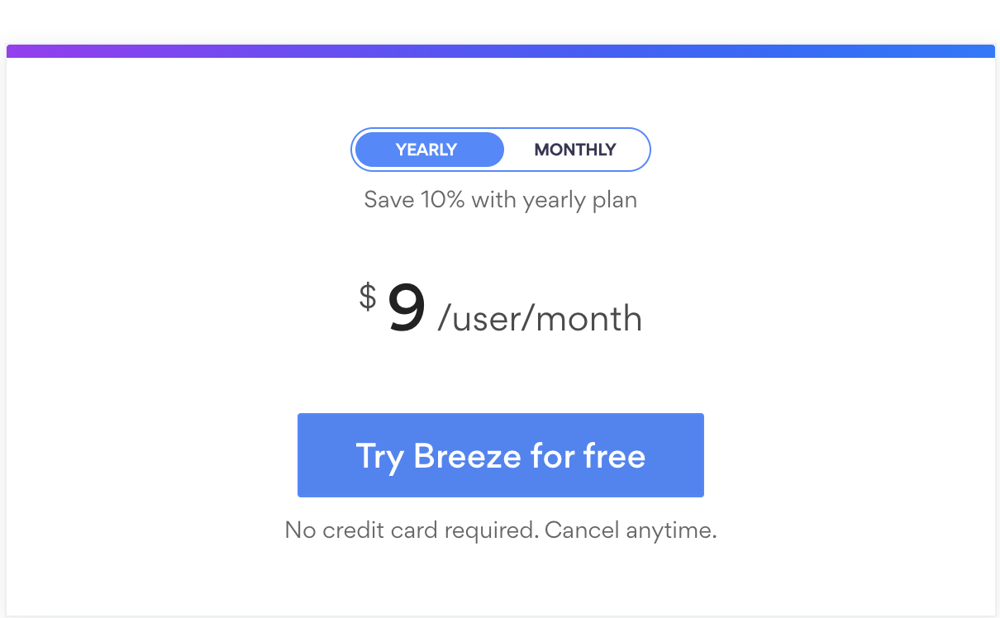
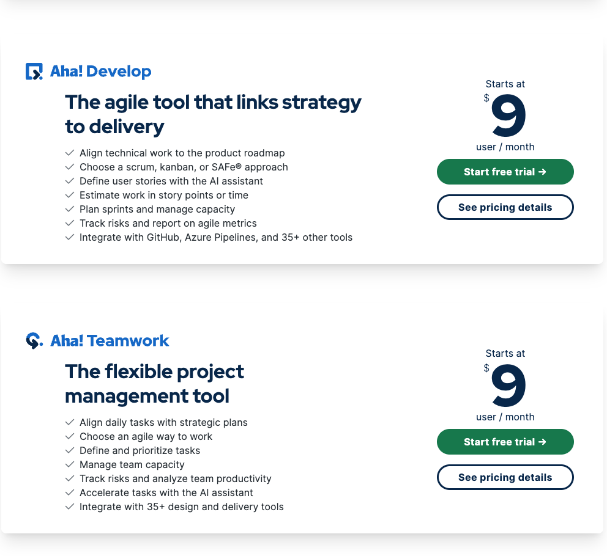
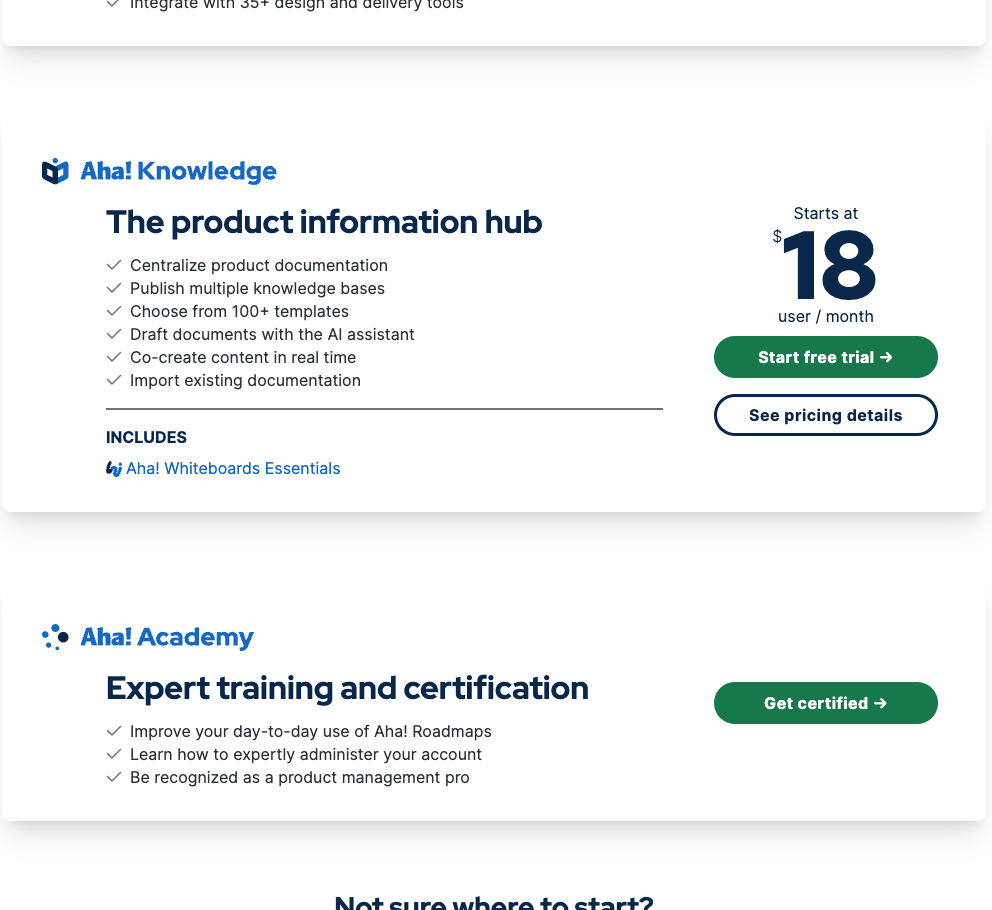
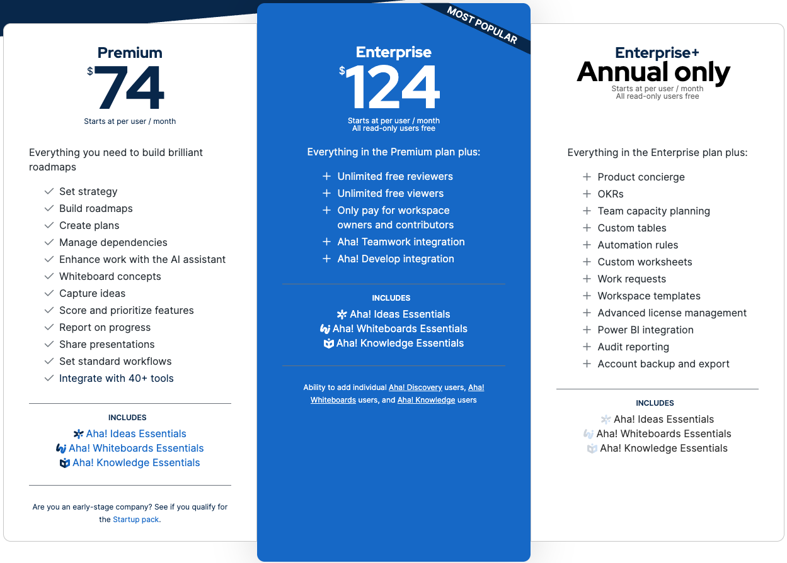
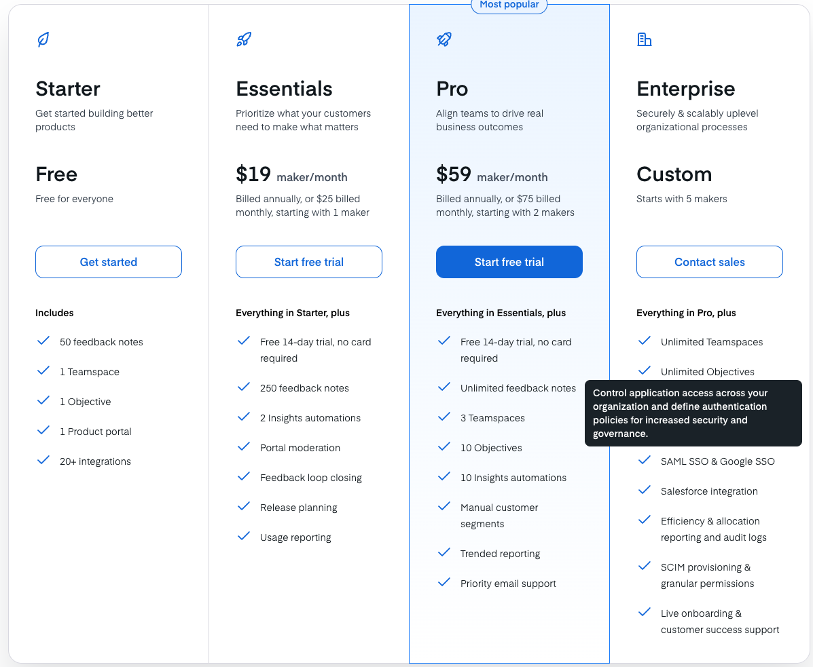
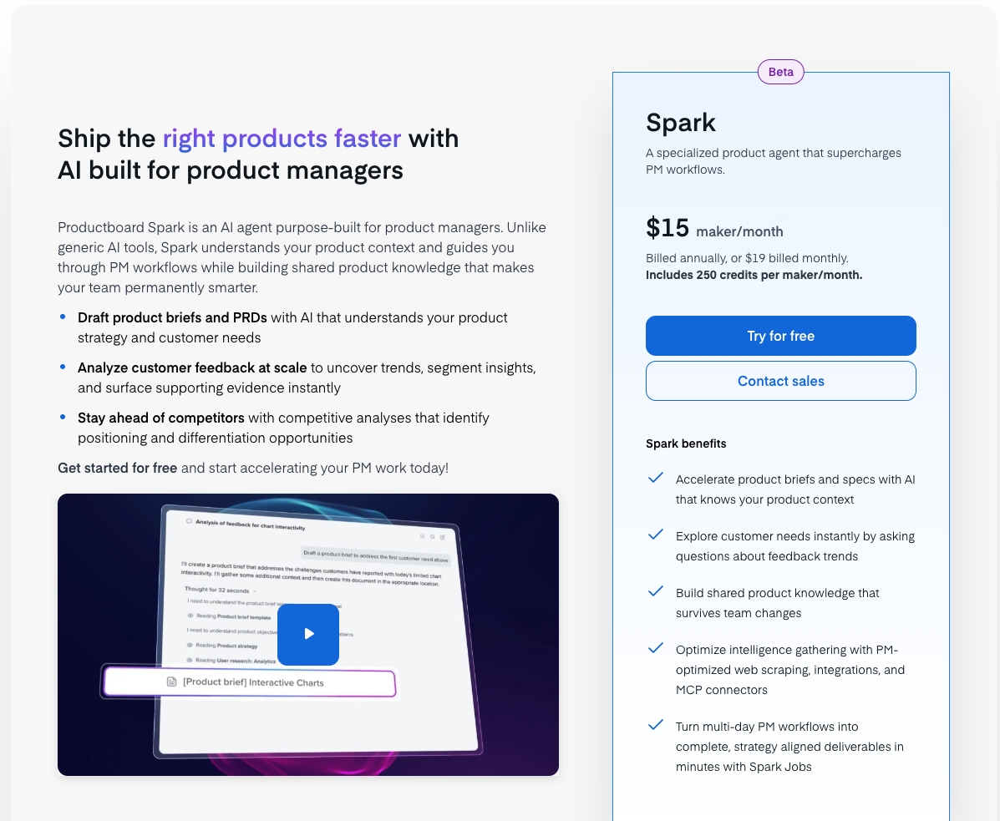
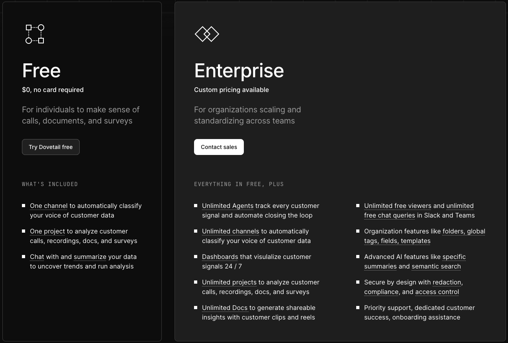
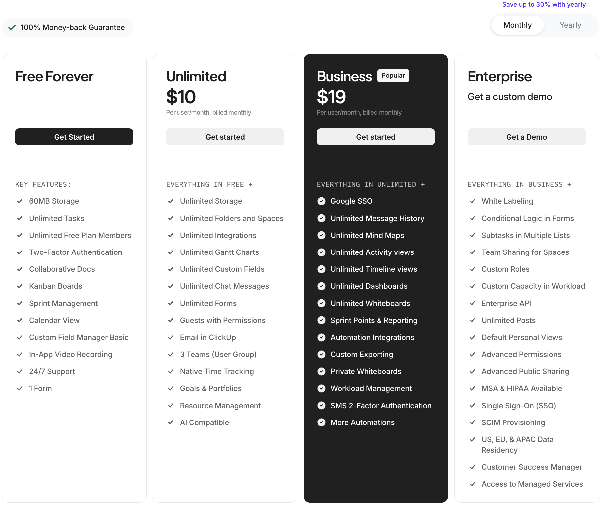
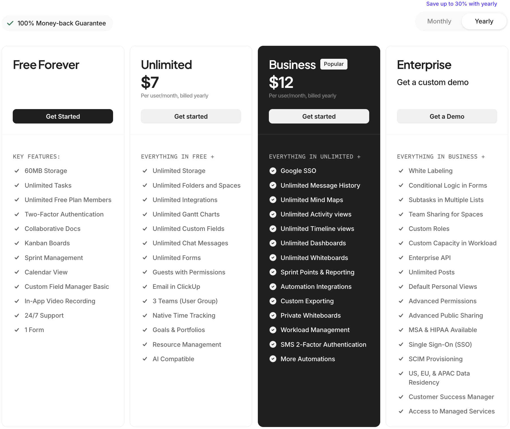

# Competitors

# Cost Comparison

### All company with Cost Structure

- **Asana**
    
    
    
    
    
    
    
    
- **Monday**
    
    
    
    
    
    
- **Pendo**
    
    
    
    
    
    
- **Breeze**
    
    
    
    
    
    
- **Aha!**
    
    
    
    
    
    
    
    
    
    
    
    
    
    
- **ProductBoard**
    
    
    
    
    
    
- **DoveTail**
    
    
    
- **ClickUp**
    
    
    
    
    
    
- **Wrike**
    
    
    

[Product_Management_Tools_Comparison.xlsx](Competitors/Product_Management_Tools_Comparison.xlsx)

| **Company/Plan** | **Roadmapping** | **Task_Management** | **Team_Collaboration** | **Customer_Research** | **Analytics_Reporting** | **Integrations** | **AI_Features** | **Mobile_Apps** | **Free_Tier** | **Best_For** |
| --- | --- | --- | --- | --- | --- | --- | --- | --- | --- | --- |
| Breeze - Single Plan ($10) | ✓ | ✓✓ | ✓✓ | ✗ | ✓ | ✓ | ✗ | ✓ | ✗ | Small teams wanting simplicity |
| Aha! Roadmaps ($59) | ✓✓ | ✓ | ✓ | Basic | ✓✓ | ✓✓ (40+) | ✓✓ | ✗ | ✗ | Enterprise product management |
| Aha! Discovery ($39) | ✗ | ✗ | ✓ | ✓✓ | ✓ | Limited | ✓ | ✗ | ✗ | Customer research focused teams |
| Aha! Ideas ($39) | ✗ | ✗ | ✓ | Basic | ✓ | Limited | ✓ | ✗ | ✗ | Idea management & feedback |
| Aha! Others ($9-18) | Partial | ✓✓ | ✓✓ | ✗ | Basic | ✓ (35+) | ✓ | ✗ | ✗ | Specific use cases |
| Asana Starter ($13.99) | Basic | ✓✓ | ✓ | ✗ | Basic | ✓✓ (100+) | ✓ | ✓ | Personal (2 users) | Growing teams |
| Asana Advanced ($30.99) | ✓ | ✓✓ | ✓✓ | ✗ | ✓✓ | ✓✓ (100+) | ✓ | ✓ | Personal (2 users) | Large teams with complex needs |
| ClickUp Unlimited ($10) | Basic | ✓✓ | ✓✓ | ✗ | ✓ | ✓✓ | ✓ | ✓ | ✓ (Limited) | Versatile teams |
| ClickUp Business ($19) | ✓ | ✓✓ | ✓✓ | ✗ | ✓✓ | ✓✓ | ✓ | ✓ | ✓ (Limited) | Teams needing advanced features |
| Monday.com Basic ($3) | Basic | ✓✓ | ✓ | ✗ | Basic | ✓ | ✗ | ✓ | ✗ | Budget-conscious teams |
| Monday.com Pro ($6.33) | ✓ | ✓✓ | ✓✓ | ✗ | ✓ | ✓✓ | Limited | ✓ | ✗ | Teams needing workflow automation |
| Wrike Team ($10) | Basic | ✓ | ✓ | ✗ | Basic | ✓ | ✓ | ✓ | ✓ (Limited) | Small to medium teams |
| Wrike Business ($25) | ✓ | ✓✓ | ✓✓ | ✗ | ✓✓ | ✓✓ | ✓✓ | ✓ | ✓ (Limited) | Complex project management |
| Dovetail (Free/Enterprise) | ✗ | ✗ | ✗ | ✓✓ | ✗ | Limited | Limited | ✗ | ✓ (Limited) | UX research teams |
| Pendo (Free/Custom) | ✗ | ✗ | ✗ | ✓ | ✓✓ | ✓ | Limited | Limited | ✓ (500 MAU) | Product analytics & user experience |

# Competitor Overview

- This table contains different software products that include some kind of product management
- Most of these products offer a diverse range management tools, where product management is one of many tools i.e.: not specifically focused on product management
- The only tools that specifically focus on product managers are: ProductBoard
- Worth considering for their strong AI adoption: Monday, ClickUp, Wrike