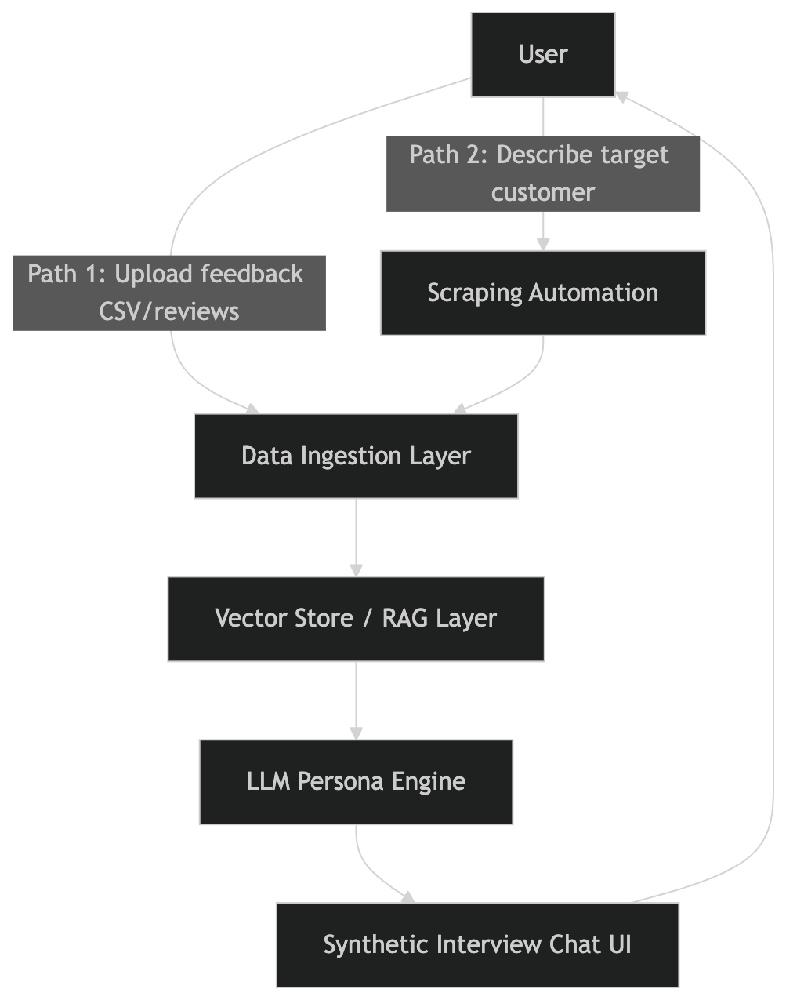

# Agile Engineering - Go_TOFU

> Source of truth imported from the main Notion page, adapted for GitHub.

## 🚀 Open in Notion

[](https://www.notion.so/codeuniversitywiki/Agile-Engineering-Go_TOFU-31a0f2153d6d807eb6bbd175a24b4ed8)

Click the badge above to view the full Notion workspace.

## ✍️ Quick Edit

[Open README directly in Obsidian](obsidian://open?vault=Docs&file=README.md)

Obsidian saves changes automatically while you edit.

## Quick Navigation

- [Knowledge Base Index](docs/index.md)
- [GoTFu Tasks](docs/gotfu-tasks/README.md)
- [Team and Roles](docs/team-and-roles/README.md)
- [Meeting Notes](docs/overview/meeting-11-march.md)
- [Competitor Analysis](docs/competitor-analysis-agile-engineering-2/README.md)
- [Interview Pipeline](docs/product-manager-interview-pipeline/README.md)
- [Updates Log](updates/README.md)

## Easy Update Workflow

1. Add or update content in `docs/`.
2. Add a short update note in `updates/daily/` or `updates/weekly/`.
3. Use one of the templates:
   - `templates/daily.md`
   - `templates/meeting-notes.md`
4. Open a PR with context using `.github/PULL_REQUEST_TEMPLATE.md`.

## Update this README in Obsidian

1. Open this repository as an Obsidian vault.
2. Open `README.md`.
3. Edit the content directly and save.
4. Commit and open PR using GitHub Desktop or the GitHub web UI when ready.

## Collaboration Workflow (Obsidian + GitHub)

### Edit with Obsidian

1. Open this repository folder in Obsidian.
2. Edit files in `docs/` (and `assets/notion/` only when needed).
3. Add a short change log entry in `updates/daily/` or `updates/weekly/`.

### Create a branch

```bash
git checkout -b docs/<short-change-name>
```

### Commit changes

```bash
git add .
git commit -m "docs: short description of change"
```

### Push branch

```bash
git push -u origin HEAD
```

### Open Pull Request

1. Go to the repository on GitHub.
2. Click **Compare & pull request** for your branch.
3. Fill in `.github/PULL_REQUEST_TEMPLATE.md`.
4. Request review before merging into `main`.

### Copy/Paste Update Entry

```md
# Update - YYYY-MM-DD

## What Changed
- 

## Why
- 

## Linked Docs
- 
```

---

## What Problem are we trying to solve

- Real user interviews are **slow, expensive, and hard to scale**
- Teams cannot access **enough customers** to talk to, especially early-stage
- Existing customer data (surveys, reviews, transcripts) sits **unused and unanalyzed**
- Getting **expert or diverse opinions** requires significant time and resources

## Approaches

- A: Synthetic Responses
- B: Pre-Personas based on publicly available data
- C: Proprietary Data from customer data



## Data Sources for Scraping

1. **App Stores**
   - AppStore (Apple)
   - PlayStore (Google)
   - ProductHunt
   - G2
   - Captera
2. **Social Media**
   - Reddit
   - Twitter/X
   - Instagram
   - Facebook
   - YouTube
3. **E-commerce**
   - Amazon, Shopify, AliExpress, Etsy, Ebay

Related:

- [Scraper Tools Overview](docs/overview/scraper-tools-overview.md)
- [Data Scraping Tools](docs/overview/data-scraping-tools.md)

## Who It Is For

- **Founders** validating ideas without enough interviews
- **Marketers and researchers** needing fast qualitative feedback
- **Teams** drowning in customer feedback (NPS, support tickets, reviews) with no clear insights

## The Solution

- AI-powered **synthetic personas** built from real data and publicly available information
- Users submit their goal + existing data to **talk to simulated customers or experts**
- Turns large-scale feedback into **decision-ready insights in minutes**, not weeks

## Strategy to get customers

- Start with a free version where users can find the right personas for their use case

## Our Strategy

### Functionalities

### Primary Functionalities - MVP

- Run ad campaign simulation

### Additional Functionalities

- Web scraping
- Pre-product-launch testing
- [node-nlp](https://www.npmjs.com/package/node-nlp)
- [Bright Data App Store Scraper](https://brightdata.com/products/web-scraper/app-store)
- [Apify App Store Scraper](https://apify.com/epctex/appstore-scraper)

### First User Segment

### Company Types

- Small to Medium Enterprises
- ScaleUps
- Large Enterprise
- Agencies and Freelancers

### Company Criteria

- Companies that already have a product and customer feedback

Related:

- [GoTFu - Tasks](docs/gotfu-tasks/README.md)

## Overview of Meeting, Materials, Resources

- [Meeting 11 March](docs/overview/meeting-11-march.md)
- [Meeting 13th March](docs/overview/meeting-13th-march.md)

## Existing Players

- **12 players offering synthetic interviews**
- Source: [Synthetic Users Tools](https://www.uxia.app/blog/synthetic-users-tools)

1. Synthetic Users
2. Uxia
3. Deepsona
4. Delve AI
5. Ditto
6. Beehive AI
7. Simsurveys
8. Custodia
9. JENTIS
10. C5i Synthetic Audiences (Microsoft Marketplace)
11. SyntheticIQ

Related:

- [What competitors offer as data enrichment for synthetic user profiles](docs/overview/what-do-competitors-offer-as-data-enrichment-for-s.md)
- [Team and Roles](docs/team-and-roles/README.md)

## Old Material

### Customer Interviews - Old Project

- [Interview Questionnaire](docs/overview/interview-questionnaire.md)
- [Customer Interview Summary - Stefan](docs/overview/customer-interview-summary-stefan-product-owner.md)
- [Customer Interview Summary - Michael Stamp](docs/overview/customer-interview-summary-michael-stamp-produc.md)
- [Customer Interview Summary - Ishan Shreshta](docs/overview/customer-interview-summary-ishan-shreshta-produ.md)
- [Customer Interview Summary - Fabian](docs/overview/customer-interview-summary-fabian-tech-pod-capt.md)
- [Product Manager Razor - Jelena M.](docs/overview/product-manager-razor-jelena-m.md)
- [Costumer Inteview - Maxime (Hitachi Rail)](docs/overview/costumer-inteview-maxime-hitachi-rail.md)
- [Costumer Inteview - Goncalo Deus](docs/overview/costumer-inteview-goncalo-deus.md)
- [Customer Interview Summary - Moritz Schroer](docs/overview/customer-interview-summary-moritz-schroer-produ.md)

### Overview - Old Project

- [Best Practices from The Mum Test](docs/overview/best-practices-from-the-mum-test.md)
- [Interview Guide V1](docs/overview/interview-guide-v1.md)
- [20260226_TofuOS business opportunity todate](docs/overview/20260226-tofuos-business-opportunity-todate.md)
- [Market Research](docs/overview/market-research.md)
- [Competitors](docs/overview/competitors.md)
- [Sprint 2 - Notes](docs/overview/sprint-2-notes.md)
- [Mid Week Check-In](docs/overview/mid-week-check-in.md)
- [Thursday Interview Insights](docs/overview/thursday-invterview-insights.md)
- [20260305_TofuOS_Business Opportunity_todate](docs/overview/20260305-tofuos-business-opportunity-todate.md)
- [Sunday Product Decision](docs/overview/sunday-product-decision.md)
- [Tasks Tracker Sprint 3](docs/tasks-tracker-sprint-3/README.md)

## Competitor Analysis - Old Project

1. What specific problem is this tool solving? Which kind of customer is this platform targeting?
2. Is this a solution specifically designed for Product Managers?
3. What interesting features are there that we could adopt?

If you know other tools that are out there, please add them.

- [Competitor Analysis Agile Engineering](docs/competitor-analysis-agile-engineering-2/README.md)
- [Product Manager Interview Pipeline](docs/product-manager-interview-pipeline/README.md)

---

## Repository Maintenance

- [Contributing Guide](CONTRIBUTING.md)
- [Updates Log](updates/README.md)
- [Knowledge Base Index](docs/index.md)
