# Market Research

# Product Management Software

- Market size for Product Management Software is not directly available

<aside>
👷‍♂️

### **Product Management Software**

- **Total PM Platform Market:** valued at **$1.35 billion in 2025** and is projected to reach **$2.81 billion by 2033**.
- **AI SaaS Market:** The broader "AI Created SaaS" market (products powered natively by AI) is estimated to hit **$770.32 billion by 2031**, growing at a **40.2% CAGR**.
- **Enterprise Spending for Large Organizations:** on average of **$52 million annually** on SaaS, with **70% of total software budgets** allocated to SaaS-based tools.
</aside>

<aside>
📈

### Market Potential

- **Product Team Integration:** Approximately **23% of organizations** are currently scaling **agentic AI systems** (autonomous workflows) within at least one business function, while another **39% are in the experimentation phase**.
- **No of Product Managers:** Of the 5.6M+ LinkedIn profiles with PM titles, only about **850,000** are active professionals in established tech ecosystems.
- **Rate of adoption and deployment of artificial intelligence (AI) in enterprise globally and in selected countries in 2023**

    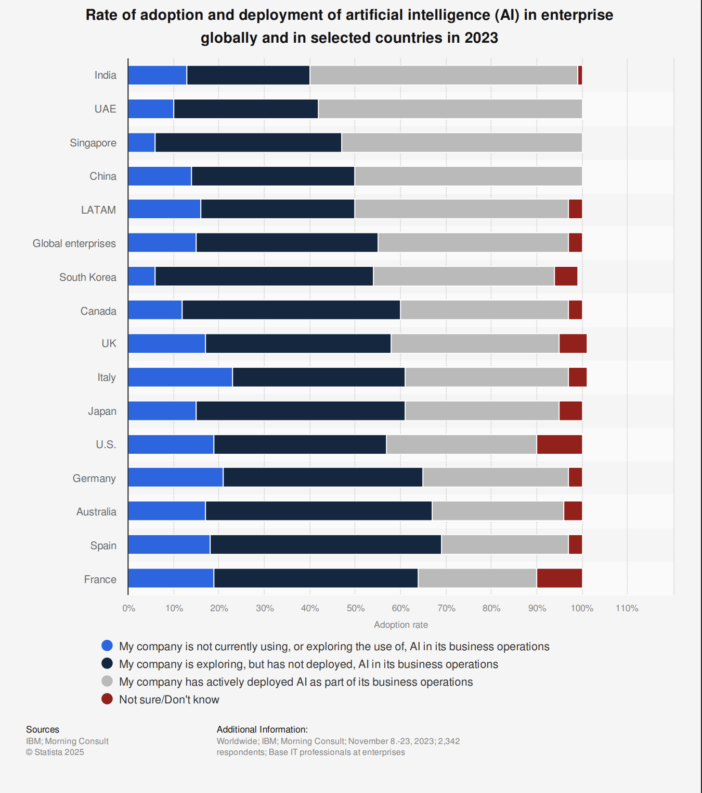

</aside>

<aside>
🌎

### **Global Software Market**

Embedded image removed from Notion export artifact.

**Projection for 2026**

- Application Development Software: $209.28 Billion
- Enterprise Software: $337.11 Billion
- System Infrastructure Software: $151.01 Billion
- Productivity Software: $ 83.53 Billion

**Projection for 2030**

- Application Development Software: $262.05 Billion
- Enterprise Software: $424.13 Billion
- System Infrastructure Software: $159.52 Billion
- Productivity Software: $ 91.69 Billion

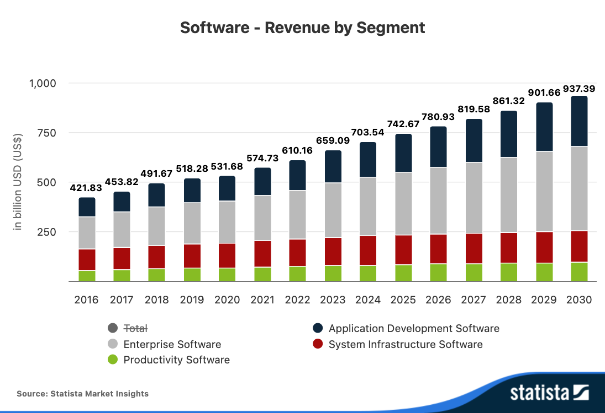

</aside>

<aside>
🥊

Competitors

- The main players in the space are currently:
    - Aha! – Enterprise‑oriented platform for strategy, portfolio management, and roadmaps.
    - Productboard – Strong on customer feedback consolidation and feature prioritization.
    - ProdPad – Outcome‑driven roadmapping and product discovery workflows.
    - airfocus – Roadmaps and prioritization with product‑ops/portfolio focus.
    - Lane – B2B SaaS‑focused platform emphasizing feedback synthesis and AI‑driven insights.
- Broader Work‑management tools that PMs use for their product hub.
    - Jira and Jira Product Discovery – Standard for agile software teams and backlog/roadmap management.
    - Monday.com / Monday Dev – Highly configurable boards for product and engineering workflows.
    - Asana – Widely used for task/project management across cross‑functional product teams.
    - Wrike – Work management with advanced workflow and reporting options.
    - ClickUp – All‑in‑one workspace customizable into a product execution hub.
</aside>

# Additional Information & Statistics

### Content Management Software

- Market size for Product Management Software is not directly available →  closest available category is the global content management software (CMS) market, which covers a range of applications that support workflow, collaboration, and coordination for enterprise teams.
- The projected revenue in the Content Management Software market is expected to reach US$24.27bn by 2026.
- The market is anticipated to demonstrate an annual growth rate (CAGR 2026-2030) of 4.66%, resulting in a market volume of US$29.12bn by 2030.
- In 2026, the average Spend per Employee in the Content Management Software market is projected to reach US$6.46.
- In US$24.27bn, 0 held a global market share of 0.
- However, in global comparison, United States is expected to generate the most revenue, reaching US$12.98bn in 2026.
- The Content Management Software market is a significant segment worldwide.
- In the worldwide market for Content Management Software, the United States continues to dominate with its robust software industry and high demand for efficient content management solutions.

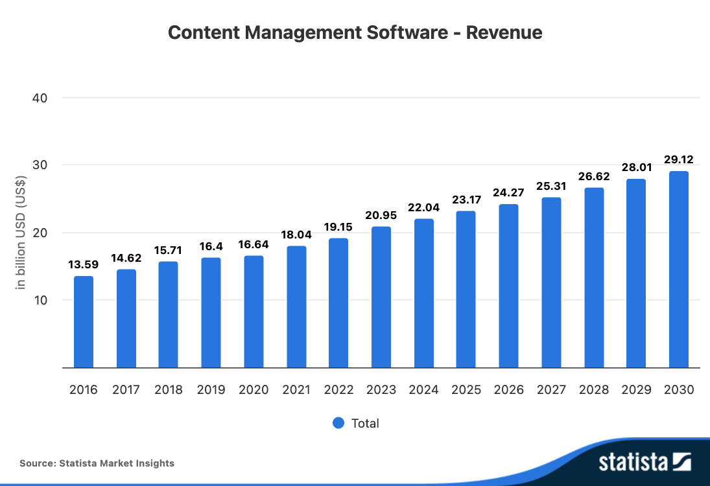

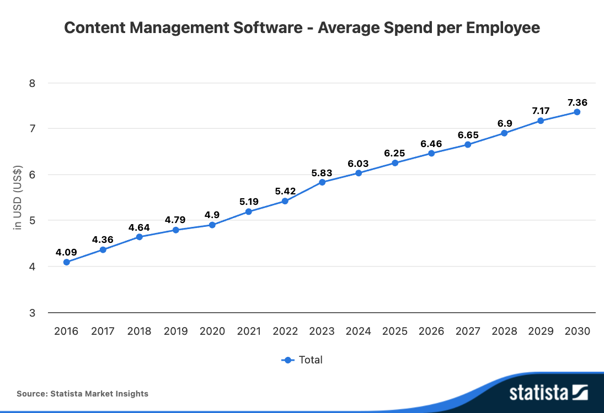

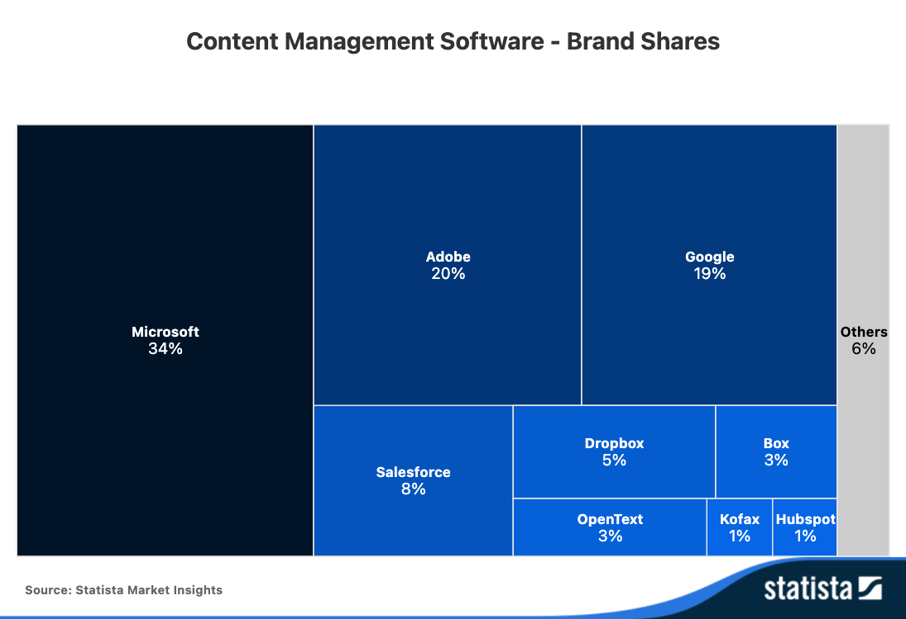

### **Enterprise Software Market - generally**

- Revenue in the Enterprise Software market is projected to reach US$88.46bn in 2026.
- Customer Relationship Management Software dominates the market with a projected market volume of US$28.37bn in 2026.
- Revenue is expected to show an annual growth rate (CAGR 2026-2030) of 6.13%, resulting in a market volume of US$112.21bn by 2030.
- The average Spend per Employee in the Enterprise Software market is projected to reach US$79.04 in 2026.
- In global comparison, most revenue will be generated United States (US$168.00bn in 2026).

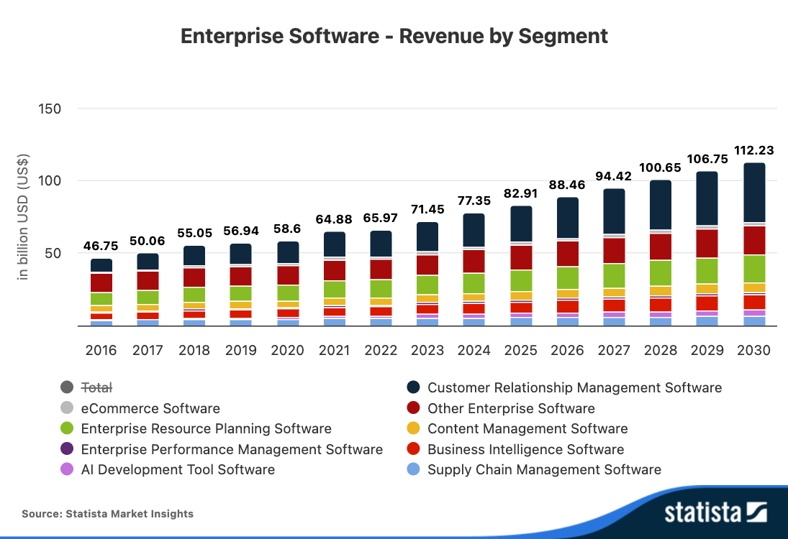

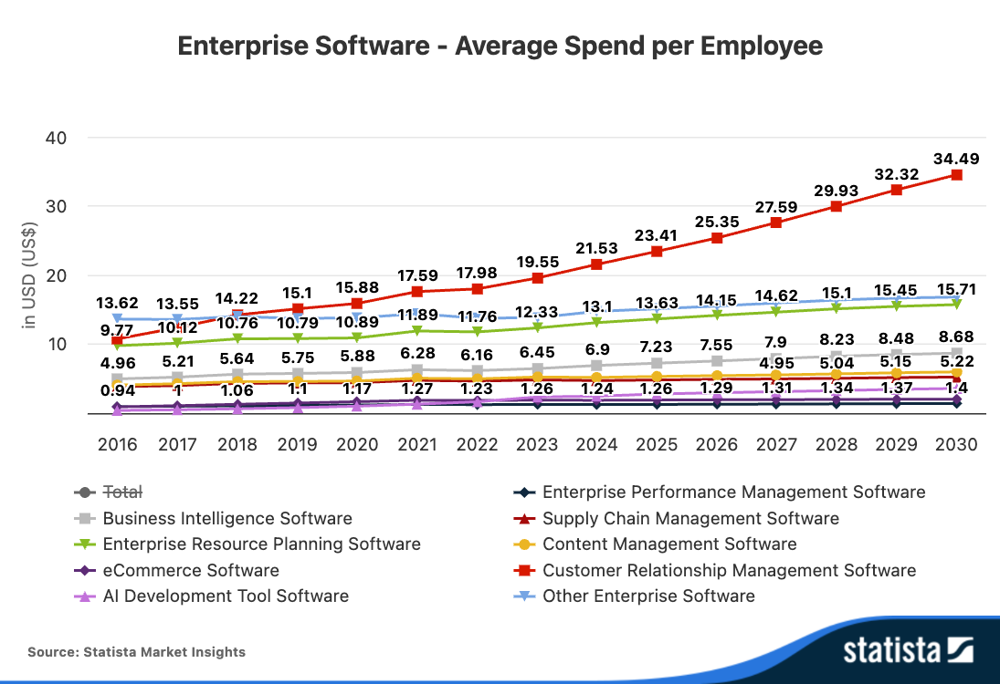

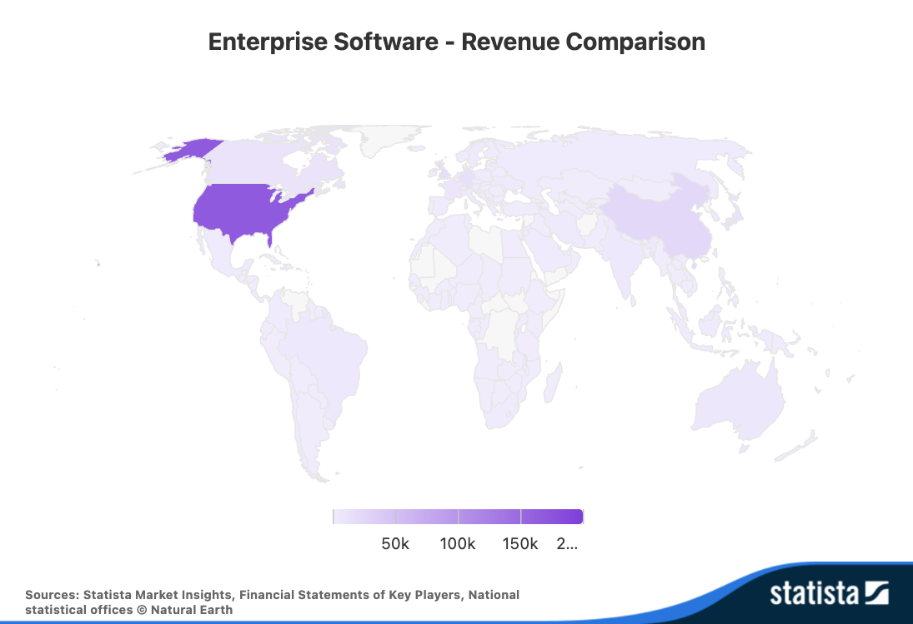

### **Enterprise Resource Planning Software**

- Revenue in the Enterprise Resource Planning Software market is projected to reach US$15.84bn in 2026.
- Revenue is expected to show an annual growth rate (CAGR 2026-2030) of 4.34%, resulting in a market volume of US$18.78bn by 2030.
- The average Spend per Employee in the Enterprise Resource Planning Software market is projected to reach US$14.15 in 2026.
- In global comparison, most revenue will be generated United States (US$28.87bn in 2026).

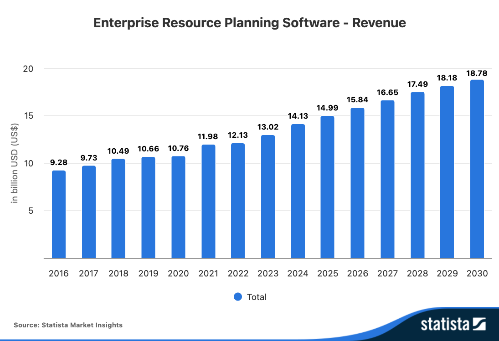

### **Productivity Software - Collaboration Software**

- Revenue in the Collaboration Software market is projected to reach US$4.27bn in 2026.
- Revenue is expected to show an annual growth rate (CAGR 2026-2030) of 3.13%, resulting in a market volume of US$4.83bn by 2030.
- In global comparison, most revenue will be generated United States (US$7.94bn in 2026).

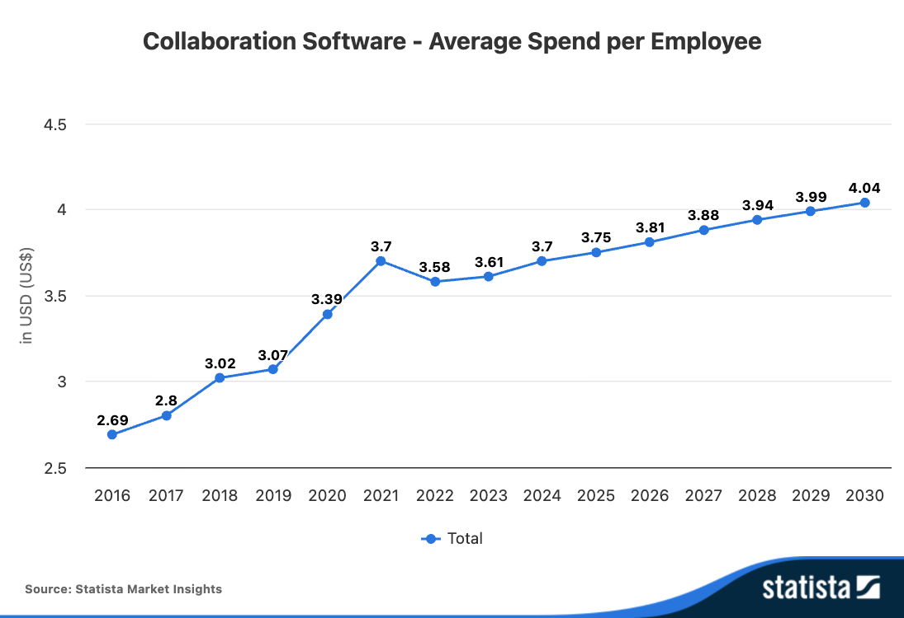

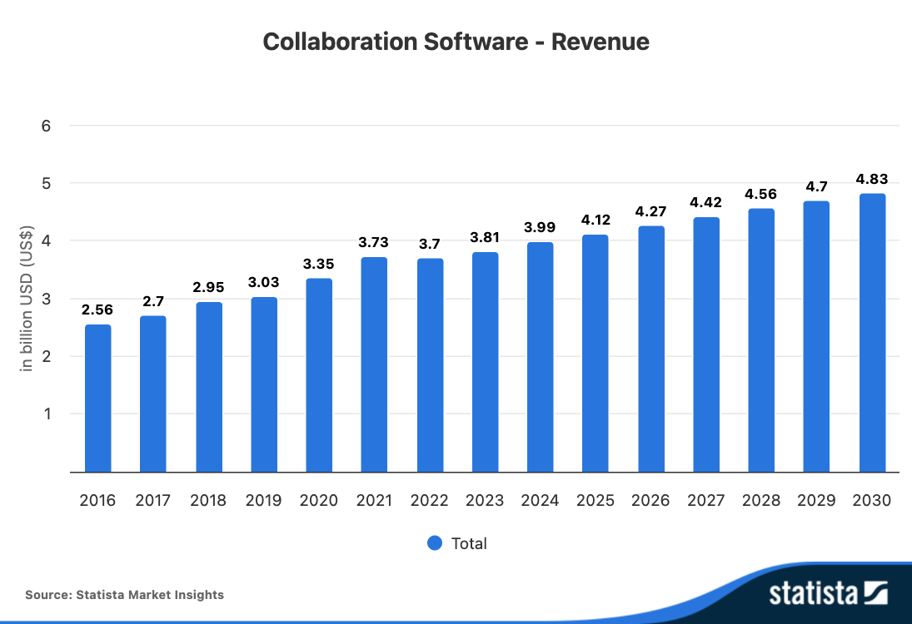

### Productivity Software - **Administrative Software**

- Revenue in the Administrative Software market is projected to reach US$4.35bn in 2026.
- Revenue is expected to show an annual growth rate (CAGR 2026-2030) of 3.94%, resulting in a market volume of US$5.08bn by 2030.
- In global comparison, most revenue will be generated United States (US$7.88bn in 2026).

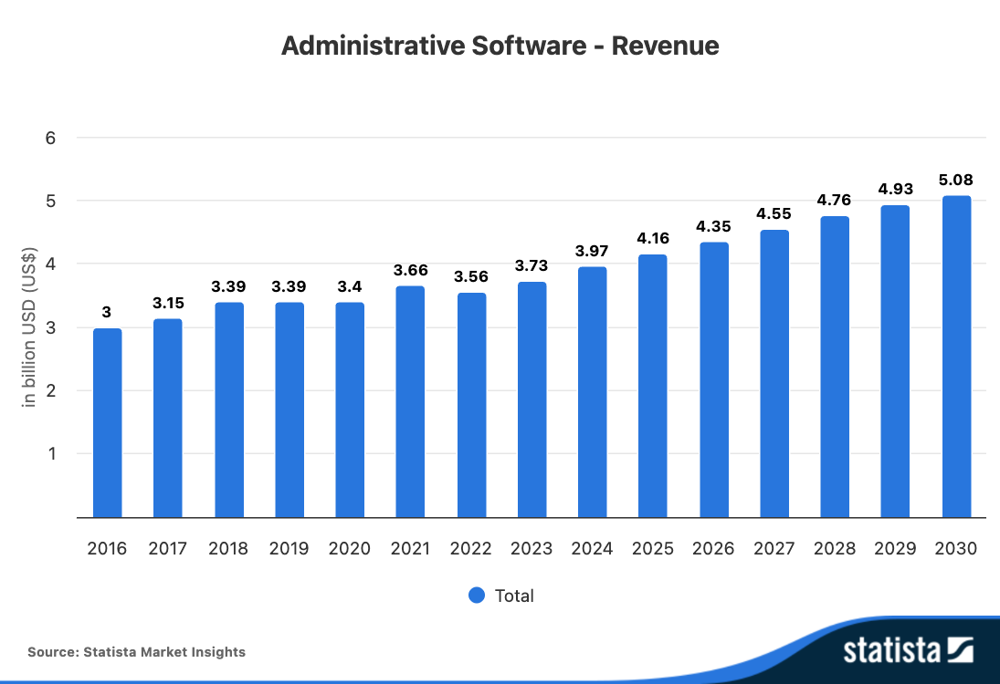

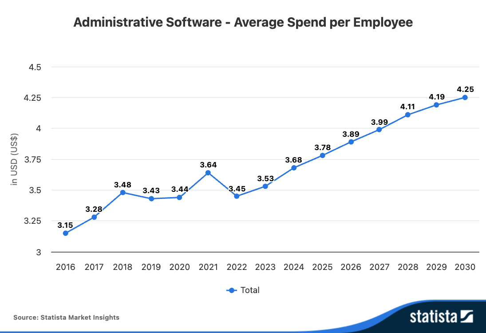

<aside>
💡

### Sources

- Statista
- https://www.datainsightsmarket.com/reports/product-management-software-1436136?tab=summary
- https://www.verifiedmarketresearch.com/product/product-management-software-market/

[From Verified Market Research - (152 pages)](../../assets/notion/market-research/global-product-management-software-market-report-sample-2033-c4eef832.pdf)

From Verified Market Research - (152 pages)

[2025: Digital Product Management Book - Springer Verlag (369 pages)](../../assets/notion/market-research/978-3-658-44276-7-262e2f38.pdf)

2025: Digital Product Management Book - Springer Verlag (369 pages)

[2026: Growth Market Reports - (60 pages](../../assets/notion/market-research/product-management-software-2a016a17.pdf)

2026: Growth Market Reports - (60 pages

</aside>
